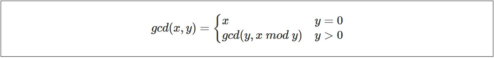

# 乘方
- 一次方  
  $ 2^1 $
- 二次方(也被称为平方)  
  $ 2^2 $
- 三次方(也被称为立方)  
  $ 2^3 $    

```python3
# 使用内置运算符号来表达
firstPowerOfTwo = 2 ** 1                        # 一次方
secondPowerOfTwo = 2 ** 2                       # 二次方(平方)
thirdPowerOfTwo = 2 ** 3                        # 三次方(立方)

print("firstPowerOfTwo:  ", firstPowerOfTwo)    # 2
print("secondPowerOfTwo: ", secondPowerOfTwo)   # 4
print("thirdPowerOfTwo:  ", thirdPowerOfTwo)    # 8


# 使用内置函数来表达
firstPowerOfTwo = pow(2, 1)                     # 一次方
secondPowerOfTwo = pow(2, 2)                    # 二次方(平方)
thirdPowerOfTwo = pow(2, 3)                     # 三次方(立方)

print("firstPowerOfTwo:  ", firstPowerOfTwo)    # 2
print("secondPowerOfTwo: ", secondPowerOfTwo)   # 4
print("thirdPowerOfTwo:  ", thirdPowerOfTwo)    # 8
```

&nbsp;  
# 单项式
> 李狗蛋买了n套书, 每套有m本, 每本5元, 总共花了多少钱?  
> 公式: $ 5mn $   
> 定义: 数字或字母的积

```python3
# 由于公式中带有未知数, 因此只能使用函数来解决.
def ligoudanDanxiangshi(n, m):
    return 5*n*m
```


&nbsp;  
# 多项式
> 李狗蛋买了3根铅笔(a元/根), 2本练习册(b元/本), 总共花了多少钱?  
> 公式: $ 3a + 2b $   
> 定义: 两组或以上的数字或字母的积相加、减

```python3
def ligoudanDuoxiangshi(a, b):
    return (3*a) + (2*b)
``` 

&nbsp;  
# 丢番图的年龄
公式: $ x = {1\over6}x + {1\over12}x + {1\over7}x + 5 + {1\over2}x + 4  $   
解题思路: 采用最小公倍数去分母, 6,12,7,2 的最小公倍数是 84.  
```
                                                # 去分母操作
      x * 84            = 84x                   # 等式左边 乘以 最小公倍数.
 (1/6)x * 84 =  (84/6)x = 14x                   # 等式右边 每项也都乘以 最小公倍数.
(1/12)x * 84 = (84/12)x = 7x   
 (1/7)x * 84 =  (84/7)x = 12x
      5 * 84            = 420      
 (1/2)x * 84 =  (84/2)x = 42x     
      4 * 84            = 336  

   84x = 14x + 7x + 12x + 420 + 42x + 336       # 合并同类项
   84x = 75x + 756                              # 合并同类项
84-75x = 756                                    # 合并同类项
    9x = 756                                    
9x / 9 = 756 / 9                                # 系数化一 
     x = 84   
```

&nbsp;  
# 最小公倍数


&nbsp;  
# 最大公约数(Greatest Common Divisor)
欧几里得(Euclid's Algorithm)算法用于计算一对`非负数`的最大公约数, 它是一个递归算法, 据说出现在公元前375年, 或许是最早的递归算法实例;   
- 符号表达:   
   
- `mathjax`语法表达:  
  ```shell script
  \begin{align}
      gcd(x, y) =
      \begin{cases}
          x                    & y = 0 \\
          gcd(y, x \ mod \  y) & y > 0
      \end{cases}
  \end{align}
  ```
- 算法解释  
  gcd(x, y) 是一个函数特征定义, 这于c/c++定义函数声明含义一致;   
  该函数要求两个参数: x(被除数) 和 y(除数).  gcd算法逻辑如下:   
  ```   
  当 y = 0 时, 返回 x ;     
  当 y > 0 时, 被除数参数由 y 担任(第一个参数), 除数参数则由 x % y 得出(第二个参数).
  ```  
- 手算(过程)   
  ```shell script
  
   gcd(20, 30)  = gcd(30, 20 % 30)
                = gcd(30, 20)
                = gcd(20, 30 % 20)
                = gcd(20, 10)
                = gcd(10, 20 % 10)
                = gcd(10, 0)
                = 10

  
   gcd(114, 42) = gcd(42, 114 % 42)
                = gcd(42, 30)
                = gcd(30, 42 % 30)
                = gcd(30, 12)
                = gcd(12, 30 % 12)
                = gcd(12, 6)
                = gcd(6, 12 % 6)
                = gcd(6, 0)
                = 6

  ```
- 代码
  [python](src/gcd/gcd.py)  
  [c++](src/gcd/gcd.cpp)  
https://www.geeksforgeeks.org/euclidean-algorithms-basic-and-extended/


&nbsp;  
# 平方根(sqaure root)
平方根指的是: 一个数能被平方, 那么就要可以被逆平方, 这个逆运算的结果就叫做平方根.   
平方根的符号表示为: $ \sqrt{100} = 10 $
https://www.geeksforgeeks.org/find-square-root-number-upto-given-precision-using-binary-search/


&nbsp;  
# 立方根(cube root)
平方根的符号表示为: $ \sqrt[3]{100} = 10 $


